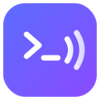

<div align="center">



# Notification Bell

**Never miss an AI agent waiting on you again.**

[](https://marketplace.visualstudio.com/items?itemName=chahe-dridi.agent-confirm-sound)
[](https://marketplace.visualstudio.com/items?itemName=chahe-dridi.agent-confirm-sound)
[](https://marketplace.visualstudio.com/items?itemName=chahe-dridi.agent-confirm-sound)
[](https://github.com/chahe-dridi/vscode-agent-bell/actions/workflows/ci.yml)
[](LICENSE.txt)
[](https://github.com/chahe-dridi/vscode-agent-bell)

Plays a sound and sends an OS notification the moment your AI agent needs attention — whether it's waiting for confirmation, asking to run a command, or finished its turn.

Works with **Claude Code**, **aider**, **Gemini CLI**, **Codex CLI**, **Cursor**, and any other terminal-based AI agent.

[**Install**](#installation) · [**Claude Code Setup**](#claude-code-integration) · [**Settings Panel**](#settings-panel) · [**Settings**](#settings) · [**Contributing**](#contributing)

</div>

---

## Table of Contents

- [Why Notification Bell?](#why-notification-bell)
- [Requirements](#requirements)
- [Installation](#installation)
- [Quick Start](#quick-start)
- [Claude Code Integration](#claude-code-integration)
- [Terminal Watching (Other Agents)](#terminal-watching-other-agents)
- [How It Works](#how-it-works)
- [Features](#features)
- [Settings Panel](#settings-panel)
- [Commands](#commands)
- [Settings](#settings)
- [Tuning Patterns for Your Agent](#tuning-patterns-for-your-agent)
- [Limitations](#limitations)
- [Support the Project](#support-the-project)
- [Contributing](#contributing)

---

## Why Notification Bell?

When AI agents run long tasks you switch to another window — and miss the moment they stop to ask you something. Every missed prompt means waiting for the agent to time out or lose context.

Notification Bell closes that gap:

- **Instant audio alert** the moment an agent needs your input
- **OS notification** so you're notified even when VS Code isn't focused
- **Focus mode** — keeps the sound but silences OS popups when you don't want banner spam
- **Status bar badge** `🔔 7` showing how many alerts fired this session
- **Reminder escalation** — re-alerts every N minutes if you still haven't responded
- **Zero configuration** required — sensible defaults work out of the box

---

## Requirements

- **VS Code** 1.93.0 or later
- **macOS** — uses `afplay` (built-in, no install needed)
- **Linux** — uses `paplay` (PulseAudio) or `aplay` (ALSA); `notify-send` for OS notifications (`libnotify-bin` on Debian/Ubuntu)
- **Windows** — uses PowerShell `SoundPlayer`; no additional dependencies
- **Claude Code integration** — requires Claude Code installed (`~/.claude/` must exist)

---

## Installation

Search **"Notification Bell"** in the VS Code Extensions view (`Ctrl+Shift+X`), or run:

```bash
code --install-extension chahe-dridi.agent-confirm-sound
```

---

## Quick Start

**1. Install the extension** — the status bar shows `🔔` when active.

**2. For Claude Code users** — accept the setup prompt on first launch, or run:
> `Ctrl+Shift+P` → `Notification Bell: Set Up Claude Code Integration`

**3. For other agents** — it works automatically. Use `terminalNameFilter` to limit which terminals are watched:
```json
"agentConfirmSound.terminalNameFilter": ["claude"]
```

**4. Open the Settings Panel** — click the `⚙` gear icon in the status bar to adjust volume, toggle focus mode, and preview sounds without leaving your workflow.

---

## Claude Code Integration

On first install, Notification Bell offers to set up a direct integration with Claude Code. Accept and it will:

1. Copy the notification sound to `~/.claude/agent-bell-notify.wav` — a stable path that survives extension updates
2. Add hooks to `~/.claude/settings.json`:

| Hook | Fires when |
|---|---|
| `Stop` | Claude finishes its turn and is waiting for your next message |
| `Notification` | Claude Code sends a background notification (e.g. window not focused) |

These hooks run directly from Claude Code's process — **they work even when VS Code is not in focus**. Each hook also writes to `~/.claude/agent-bell-signal` so the extension can flash the status bar and show an OS notification inside VS Code.

**To set up manually:**
`Ctrl+Shift+P` → `Notification Bell: Set Up Claude Code Integration`

**To remove:**
`Ctrl+Shift+P` → `Notification Bell: Remove Claude Code Integration`

> **PreToolUse hook:** If you run Claude Code with manual bash approval (`requiresApproval`), enable `agentConfirmSound.hookPreToolUse: true` and reinstall the integration. Leave this off if bash is auto-approved — it would fire on every command.

> **Before uninstalling:** run `Notification Bell: Remove Claude Code Integration` first to clean up hooks and the copied sound file from `~/.claude/`.

> **Privacy:** Notification Bell only writes to your local `~/.claude/settings.json`. No data is read, collected, or sent anywhere.

---

## Terminal Watching (Other Agents)

To quiet one noisy terminal, select it and run **Notification Bell: Mute This Terminal** from the Command Palette. Other terminals keep alerting. Run **Notification Bell: Unmute This Terminal** to resume its alerts.

Muting suppresses prompt and command-completion alerts and cancels that terminal's pending reminder. Hover over the bell in the status bar to see muted terminal names. Mutes are in memory only and clear when the terminal closes or the extension reloads. Claude Code hook alerts are unaffected because hooks do not identify their terminal.

For agents running in a standard VS Code terminal — aider, Gemini CLI, custom scripts — Notification Bell watches terminal output and plays a sound when a line matches a configured regex pattern such as `(y/n)`, `Allow this action?`, or `Press enter to confirm`.

> Requires shell integration, which is on by default for bash, zsh, fish, and PowerShell in recent VS Code. A small decoration appears to the left of your prompt when it's active.

**Quick setup for common agents:**

| Agent | `terminalNameFilter` value |
|---|---|
| Claude Code | `["claude"]` |
| aider | `["aider"]` |
| Gemini CLI | `["gemini"]` |
| Codex CLI | `["codex"]` |

Leave the filter empty (`[]`) to watch all terminals.

---

## How It Works

```
Claude Code (UI / CLI)
  └── ~/.claude/settings.json hooks
        ├── Stop         → plays sound + writes ~/.claude/agent-bell-signal
        └── Notification → plays sound + writes ~/.claude/agent-bell-signal
              └── fs.watch() in extension
                    └── status bar flash + OS notification

Other terminal agents (aider, Gemini CLI, scripts, etc.)
  └── VS Code shell integration API
        └── pattern match on terminal output
              └── sound + status bar flash + OS notification
```

---

## Features

| | Feature |
|---|---|
| 🪝 | **Claude Code hook integration** — works without shell integration, even when VS Code is not focused |
| 🔊 | **Sound alert** on any configurable regex pattern in terminal output |
| ⏱️ | **Command-end alert** — plays when long-running commands finish (configurable minimum duration) |
| 🔔 | **Status bar badge** — shows session alert count (`🔔 7`), flashes on alert |
| 🖥️ | **OS notification** when VS Code is not focused (Windows balloon / macOS notification center / Linux notify-send) |
| 🎛️ | **Settings panel** — gear icon in status bar opens a panel with volume pills, toggles, and event previews |
| 🎯 | **Focus mode** — keeps the sound playing but silences OS popup notifications |
| 🔇 | **Auto-mute when focused** — suppresses sound when VS Code is your active window |
| ⚡ | **Alert triggers** — choose to alert on confirmations, task completions, or both |
| ⏰ | **Reminder escalation** — re-alerts after N minutes if you haven't responded |
| 🎵 | **Two bundled sounds** + support for custom files with random or fixed rotation |
| 🔉 | **Volume control** on all platforms (afplay / paplay / WAV sample scaling on Windows) |
| 🔍 | **Terminal name filter** — watch only terminals named "claude" or "aider" |
| 🧪 | **Pattern tester** — paste terminal output, see which pattern matched, copies regex to clipboard |
| 📋 | **Alert history** — last 100 alerts with time, source, and trigger, persisted across reloads |
| 🌍 | **Cross-platform** — macOS, Windows, Linux |

---

## Settings Panel

Click the `⚙` gear icon in the status bar (or run `Notification Bell: Open Settings Panel`) to open the settings panel in the bottom panel area — the same area as Terminal and Output.

The panel gives you quick access to the most common settings without opening `settings.json`:

| Control | What it does |
|---|---|
| **Volume pills** | Click any percentage to change volume instantly (0% – 200%) |
| **Auto-mute when focused** | Toggle — suppresses sound while VS Code is your active window |
| **Focus mode** | Toggle — keeps the sound but hides OS popup notifications |
| **Min task duration** | How long a command must run before "task done" fires |
| **Events section** | Shows which sound plays for each event type with Preview / Change buttons |

Every row in the panel has an `!` info badge — hover it to see a plain-language description of what the setting does.

---

## Commands

Open the Command Palette (`Ctrl+Shift+P`) and type "Notification Bell":

| Command | Description |
|---|---|
| `Notification Bell: Toggle Watching` | Pause or resume terminal watching. |
| `Notification Bell: Mute This Terminal` | Mute alerts and cancel any pending reminder for the active terminal. |
| `Notification Bell: Unmute This Terminal` | Resume alerts for the active terminal. |
| `Notification Bell: Play Test Sound` | Play the alert sound immediately to verify audio is working. |
| `Notification Bell: Show Log` | Open the output channel for match logs and debug info. |
| `Notification Bell: Test Pattern` | Enter terminal output — see which pattern matched and copies the regex to clipboard. |
| `Notification Bell: Set Up Claude Code Integration` | Install Stop + Notification hooks into `~/.claude/settings.json`. |
| `Notification Bell: Remove Claude Code Integration` | Remove hooks and delete the copied sound file. Run before uninstalling. |
| `Notification Bell: Manage Sounds` | Switch between bundled sounds, add custom files, toggle random mode. |
| `Notification Bell: Add Sound File` | Browse and add a custom sound file (.wav / .mp3 / .aiff / .ogg / .flac). |
| `Notification Bell: Show Alert History` | View the last 100 alerts — time, source, and what triggered each. |
| `Notification Bell: Configure Alert Triggers` | Choose when to alert: confirmations, task completions, or both. Supports per-workspace scope. |
| `Notification Bell: Open Settings Panel` | Open the settings panel in the bottom panel area. |
| `Notification Bell: Dismiss Reminder` | Cancel the active reminder escalation immediately. |
| `Notification Bell: Reset to Defaults` | Reset all Notification Bell settings to their defaults. |

---

## Settings

Open Settings (`Ctrl+,`) and search **"Notification Bell"**, or add to `settings.json`:

### Core

| Setting | Default | Description |
|---|---|---|
| `agentConfirmSound.enabled` | `true` | Turn terminal watching on/off. |
| `agentConfirmSound.alertOn` | `["confirmation","completion"]` | When to fire alerts. `confirmation` = agent waiting for y/n or approval. `completion` = command or agent turn finished. Use `Configure Alert Triggers` for an easier picker. |
| `agentConfirmSound.patterns` | *(see below)* | Case-insensitive regex array matched against terminal output. |
| `agentConfirmSound.terminalNameFilter` | `[]` | Only watch terminals whose name contains one of these strings. Empty = watch all. |
| `agentConfirmSound.debounceMs` | `4000` | Minimum ms between alerts per terminal — prevents repeated sounds on the same prompt. |

### Sound

| Setting | Default | Description |
|---|---|---|
| `agentConfirmSound.sounds` | `[]` | List of custom sound file paths (.wav / .mp3 / .aiff, plus .ogg / .flac on Linux). Empty = use bundled sound. |
| `agentConfirmSound.soundMode` | `"fixed"` | `"fixed"` uses the first sound. `"random"` picks one at random each alert. |
| `agentConfirmSound.volume` | `1` | Volume 0–1 (up to 2 for boost). Applied via afplay (macOS), paplay (Linux), WAV sample scaling (Windows). |

### Alerts & Notifications

| Setting | Default | Description |
|---|---|---|
| `agentConfirmSound.focusTerminal` | `false` | Auto-focus the matching terminal when an alert fires. |
| `agentConfirmSound.alertOnCommandEnd` | `true` | Play a sound when any long-running terminal command finishes. |
| `agentConfirmSound.commandEndMinDurationMs` | `3000` | Minimum command duration (ms) before "command finished" fires. Quick commands like `ls` are ignored. |
| `agentConfirmSound.osNotification` | `true` | Show an OS-level notification when VS Code is not focused. |
| `agentConfirmSound.focusMode` | `false` | Keep the alert sound but suppress OS popup notifications (balloon / banner / notify-send). |
| `agentConfirmSound.muteWhenFocused` | `false` | Suppress alert sounds while VS Code is your active window. History and status bar still update. |
| `agentConfirmSound.reminderIntervalMs` | `0` | Re-alert after this many ms if you haven't responded. `0` = disabled. Example: `120000` for 2 minutes. |
| `agentConfirmSound.reminderMaxCount` | `3` | Maximum number of reminders before stopping. |

### Claude Code Hook

| Setting | Default | Description |
|---|---|---|
| `agentConfirmSound.hookPreToolUse` | `false` | Also fire on Claude Code's PreToolUse(Bash) hook. Only useful with manual bash approval. |

### Debug

| Setting | Default | Description |
|---|---|---|
| `agentConfirmSound.debugLog` | `false` | Log every terminal chunk to the output channel. Use to tune patterns — disable when done. |

---

### Bundled sounds

Two sounds ship with the extension, selectable from **Notification Bell: Manage Sounds**:

| Sound | Description |
|---|---|
| `notify.wav` | Short, crisp chime (default) |
| `notification-bell.mp3` | Fuller bell tone |

---

### Default patterns

```json
"agentConfirmSound.patterns": [
  "\\(y\\s*/\\s*n\\)",
  "\\[y\\s*/\\s*n\\]",
  "\\(Y\\s*/\\s*n\\)",
  "\\[Y\\s*/\\s*n\\]",
  "do you want to proceed",
  "do you want to continue",
  "allow this (action|command|tool)",
  "would you like to proceed",
  "press enter to confirm",
  "confirm\\?\\s*$",
  "proceed\\?\\s*$",
  "continue\\?\\s*$",
  "\\(yes/no\\)",
  "type ['\"]?yes['\"]? to continue",
  "allow (read|write|execute|bash|edit|create|delete|tool)",
  "do you want claude",
  "waiting for (your )?input",
  "execute.*\\?",
  "overwrite.*\\?",
  "enter (your )?choice",
  "are you sure\\?",
  "\\[A\\]llow",
  "press any key"
]
```

---

### Common configuration examples

**Watch only Claude Code terminals:**
```json
"agentConfirmSound.terminalNameFilter": ["claude"]
```

**Sound on but no popup banners:**
```json
"agentConfirmSound.focusMode": true
```

**Silent when you're actively watching VS Code:**
```json
"agentConfirmSound.muteWhenFocused": true
```

**Custom sound at half volume:**
```json
"agentConfirmSound.sounds": ["/Users/you/sounds/ping.wav"],
"agentConfirmSound.volume": 0.5
```

**Multiple sounds in random rotation:**
```json
"agentConfirmSound.sounds": [
  "/Users/you/sounds/ping.wav",
  "/Users/you/sounds/chime.wav"
],
"agentConfirmSound.soundMode": "random"
```

**2-minute reminders, up to 3 times:**
```json
"agentConfirmSound.reminderIntervalMs": 120000,
"agentConfirmSound.reminderMaxCount": 3
```

---

## Tuning Patterns for Your Agent

Every agent phrases prompts differently. To find the exact text yours outputs:

1. Set `"agentConfirmSound.debugLog": true`
2. Open **Notification Bell: Show Log**
3. Trigger a prompt in your agent
4. Copy the `[debug]` line text
5. Run **Notification Bell: Test Pattern** and paste it — shows which pattern matched and copies the regex to your clipboard
6. Paste directly into `agentConfirmSound.patterns` in `settings.json`
7. Set `"agentConfirmSound.debugLog": false` when done

---

## Limitations

- Terminal watching requires shell integration. Full-screen TUI apps that repaint the terminal (like Claude Code CLI in interactive mode) may not expose clean text — use the Claude Code hook integration instead.
- `PreToolUse` fires before **every** bash command, not just approval prompts. Leave `hookPreToolUse` off unless you use manual approval mode.
- Volume scaling only applies to uncompressed 16-bit PCM WAV files. MP3 and other formats play at their encoded volume on Windows.
- Linux OS notifications require `notify-send` (`libnotify-bin` on Debian/Ubuntu, `libnotify` on Arch). The extension logs a warning if it's missing.
- The Claude Code hook integration requires Claude Code to be installed (`~/.claude/` must exist).

---

## Support the Project

If Notification Bell saves you from missing a prompt, a ⭐ on GitHub helps others find it.

**[⭐ Star on GitHub](https://github.com/chahe-dridi/vscode-agent-bell)**

---

## Contributing

Found a bug or want to add support for a new agent? Contributions are welcome.

See **[CONTRIBUTING.md](CONTRIBUTING.md)** for the full guide — branch strategy, pattern rules, and dev environment setup.

Look for [`good first issue`](https://github.com/chahe-dridi/vscode-agent-bell/issues?q=is%3Aopen+label%3A%22good+first+issue%22) labels to find something to work on.

**Branch strategy:** all PRs go against `dev`, not `master`. `master` is the stable marketplace branch.

```bash
git clone https://github.com/chahe-dridi/vscode-agent-bell.git
cd vscode-agent-bell
git checkout dev
npm install
npm run compile
# Press F5 in VS Code to launch the Extension Development Host
```

```bash
# Build and install locally for testing
npm run package
code --install-extension dist/agent-confirm-sound-<version>.vsix --force
```

**CI runs automatically on every PR** and checks that the code compiles, no `dist/` files are committed, no network calls were introduced, the version was bumped, the CHANGELOG was updated, and no commands or settings were removed. Make sure all checks pass before requesting a review.
